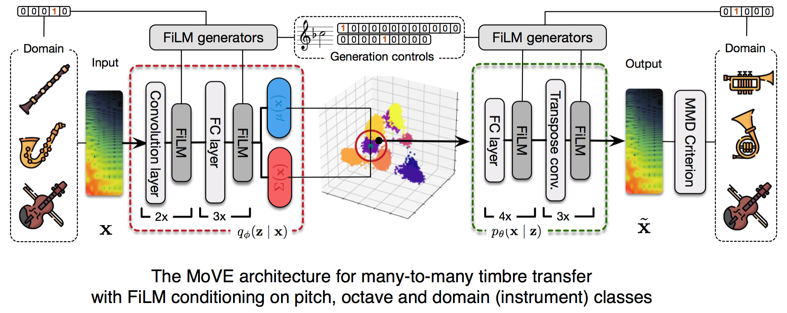

# Modulated Variational auto-Encoders (MoVE) for many-to-many musical timbre transfer

This repository is a companion to the paper submitted to ICLR2019 entitled *Modulated Variational auto-Encoders for many-to-many musical timbre transfer*. Please visit https://openreview.net/forum?id=HJgOl3AqY7 for accessing the reviews.

Generative models have been successfully applied to image style transfer and domain translation. However, there is still a wide gap in the quality of results when learning such tasks on musical audio. Furthermore, most translation models only enable *one-to-one* or *one-to-many* transfer by relying on separate encoders or decoders and complex, computationally-heavy models. In this paper, we introduce the **Modulated Variational auto-Encoders** (MoVE) to perform *musical timbre transfer*. First, we define timbre transfer as applying parts of the auditory properties of a musical instrument onto another. We show that we can achieve and improve this task by conditioning existing domain translation techniques with **Feature-wise Linear Modulation** (FiLM). Then, by replacing the usual adversarial translation criterion by a **Maximum Mean Discrepancy** (MMD) objective, we alleviate the need for an auxiliary pair of discriminative networks. This allows a faster and more stable training, along with a controllable latent space encoder. By further conditioning our system on several different instruments, we can generalize to *many-to-many* transfer within a single variational architecture able to perform multi-domain transfers. Our models map inputs to **3-dimensional representations**, successfully translating timbre from one instrument to another and supporting sound synthesis on a reduced set of control parameters. We evaluate our method in reconstruction and generation tasks while analyzing the auditory descriptor distributions across transferred domains. We show that this architecture incorporates generative controls in multi-domain transfer, yet remaining rather light, fast to train and effective on small datasets.

The following sections detail some materials that could not be included in the paper submission:
  * [Audio samples generated by the models](#audio-examples)
  * [Audio descriptor evaluations of the generative power of the models](#audio-descriptor-based-evaluations)
  * [3-dimensional latent representations directly learnt by the models](#latent-space-visualisations)
  * [Additional model comparisons and latest benchmarks](#benchmarks)

## Audio examples

### Timbre transfer on notes

The following audio files allow for individual listening of real note recordings from the **Studio-On-Line** database with corresponding reconstruction of the original instrument timbre and transfer to a target instrument timbre. These note recordings belong to the test set and were fully kept separate from the training. These samples are the direct results of the *Griffin-Lim* (GL) inversion on the *Non-Stationnary Gabor Transform* (NSGT-Mel magnitudes) output by the models.

As mentionned in the corresponding paper, the transfers are not intended to absolutely translating from one instrument to an other, instead we transfer features and blend sound qualities in ways that make sound a given note as played by other instruments. Hence these audio samples combine various input instruments and dynamics with several target timbres, giving the listener an overview of the possible timbre blendings and modifications enabled by the orchestra.

*Eg. translating from Flute to Violoncello is not creating the same quality as translating from Tenor-Trombone to Violoncello but both still render an illusion of the input note being bowed by a Violoncello.*

**This inversion method from magnitude spectrograms introduces audio artifacts (from the phase approximation) that are added to the network approximation**

We use multi-domain MoVE models trained on

*Alto-Saxophone, Flute, French-Horn, Violin* (see ./note_transfers/MoVE_multi/multi_0_3_5_8)

https://soundcloud.com/user-363438060/sets/many-to-many-timbre-transfers-on-notes-multi_0_3_5_8

*Clarinet-Bb, Violoncello, Tenor-Trombone, Piano* (see ./note_transfers/MoVE_multi/multi_2_6_9_11).

https://soundcloud.com/user-363438060/sets/many-to-many-timbre-transfers-on-notes-multi_2_6_9_11

The file names follow this nomenclature:

**(note name) ___ nsgtinv _ (input instrument)** this is intended to give the audio quality of the unprocessed NSGT inversion

**(note name) ___ rec _ (input instrument)** this is the inversion of the model's reconstruction of the input instrument timbre

**(note name) __ trans _ (target instrument)** this is the inversion of the model's transfer to a target instrument timbre

Below we display the corresponding spectrograms with first the input NSGT spectrogram and its reconstruction. Followed by the reconstructed spectrogram and each corresponding transfer.

**Alto-Saxophone reconstruction of ASax-ord-D#5-mf**

Transfer to Flute of *ASax-ord-D#5-mf*

Transfer to French-Horn of *ASax-ord-D#5-mf*

Transfer to Violin of *ASax-ord-D#5-mf*

**French-Horn reconstruction of Corf-ordinario-C4-f**

Transfer to Alto-Saxophone of *Corf-ordinario-C4-f*

Transfer to Flute of *Corf-ordinario-C4-f*

Transfer to Violin of *Corf-ordinario-C4-f*

**Flute reconstruction of Fl-ord-A#4-ff**

Transfer to Alto-Saxophone of *Fl-ord-A#4-ff*

Transfer to French-Horn of *Fl-ord-A#4-ff*

Transfer to Violin of *Fl-ord-A#4-ff*

**Violin reconstruction of Vn-ord-B4-pp**

Transfer to Alto-Saxophone of *Vn-ord-B4-pp*

Transfer to Flute of *Vn-ord-B4-pp*

Transfer to French-Horn of *Vn-ord-B4-pp*

**Clarinet-Bb reconstruction of ClBb-ord-E3-mf**

Transfer to Piano of *ClBb-ord-E3-mf*

Transfer to Tenor-Trombone of *ClBb-ord-E3-mf*

Transfer to Violoncello of *ClBb-ord-E3-mf*

**Piano reconstruction of Pno-ord-A4-ff**

Transfer to Clarinet-Bb of *Pno-ord-A4-ff*

Transfer to Tenor-Trombone of *Pno-ord-A4-ff*

Transfer to Violoncello of *Pno-ord-A4-ff*

**Violoncello reconstruction of Vc-ord-B5-pp**

Transfer to Clarinet-Bb of *Vc-ord-B5-pp*

Transfer to Piano of *Vc-ord-B5-pp*

Transfer to Tenor-Trombone of *Vc-ord-B5-pp*

**Tenor-Trombone reconstruction of trbt-ordinario-E3-pp**

Transfer to Clarinet-Bb of *trbt-ordinario-E3-pp*

Transfer to Piano of *trbt-ordinario-E3-pp*

Transfer to Violoncello of *trbt-ordinario-E3-pp*

### Timbre transfer on instrument solos

The following samples are generated by applying our models trained on individual note recordings to transfer solo instrument recordings to an other timbre. This task is much foreign to the networks that were solely trained on individual notes sustained for around 5 seconds with a unique set of pitch, octave and dynamic labels. These challenge more the generative capacity of the models and allow for a global listening evaluation of the results.

None of the input audio files were seen during training. The only supervision in these transfers is providing a pitch and octave conditionning to the model together with a target instrument timbre. We use Tony (https://code.soundsoftware.ac.uk/projects/tony) to automatically extract and export pitch tracks, converted to pitch and octave conditionning for the models.

No annotation pre-processing was added to the automatic pitch track extraction. No sound post-processing is involved, we provide the raw output of the network inverted to signal domain with Griffin-Lim and overlap-add.

**This inversion method from magnitude spectrograms introduces audio artifacts (from the phase approximation) that are added to the network approximation**

In the following playlist, we use models trained on an Alto-Saxophone and Violin instrument pair to perform one-to-one timbre transfers in between each instrument.

https://soundcloud.com/user-363438060/sets/one-to-one-timbre-transfers-on-instrument-solos
(corresponding audio files can be directly downloaded in ./solo_transfers/MoVE_pair/)

In the following playlist, we use multi-domain MoVE models trained on various instrument subsets (eg. Alto-Saxphone+Flute+Violin+French-Horn or Clarinet+Violoncello+Tenor-Trombone+Piano) to perform many-to-many timbre transfers.

https://soundcloud.com/user-363438060/sets/many-to-many-timbre-transfers-on-instrument-solos
(corresponding audio files can be directly downloaded in ./solo_transfers/MoVE_multi/)

### Latent audio synthesis paths

The representations learnt by the models support continuous audio synthesis paths from 3 latent variables with external control over pitch, octave and target instrument conditions, acting as timbre synthesizers with visualizations corresponding to smoothly evolving sound qualities. The MoVE architecture does not rely on temporal recurrence, each spectrogram slice of dimensions 16x500 (16 frames and 500 Mel bins with about 120ms context) is mapped to the 3-dimensional latent space without time relationships to others. Nonetheless, the audio renders consistent timbre interpolations in the latent space.

We use three types of synthesis paths, *linear* in between two random coordinates, corresponding *geodesic optimized* trajectory and *geodesic shooting* of the latent space under the same conditionning.

**MoVE\* model trained on a Alto-Saxophone (domain 0) and Violin (domain 1) pair**

The animations below show different latent synthesis paths and their decoded spectral distributions. The corresponding videos with audio are available at "./synth_paths/move_star_Asax_violin" (the github preview is slow, we recommend direct downloading them to your computer).

*Linear path in the Alto-Saxophone domain:* [animation](https://github.com/anonymous124/iclr2019MoVE/blob/master/docs/synth_paths/move_star_Asax_violin/path_1_geodesic_linear_Din_0_Pin_0_Oin_2.mov)

*Geodesic optimized path in the Alto-Saxophone domain:* [animation](https://github.com/anonymous124/iclr2019MoVE/blob/master/docs/synth_paths/move_star_Asax_violin/path_1_geodesic_optimized_Din_0_Pin_0_Oin_2.mov)

*Geodesic shooting path in the Alto-Saxophone domain and transferred to Violin domain:* [left animation](https://github.com/anonymous124/iclr2019MoVE/blob/master/docs/synth_paths/move_star_Asax_violin/path_1_geodesic_shooting_Din_0_Pin_0_Oin_2.mov) [right animation](https://github.com/anonymous124/iclr2019MoVE/blob/master/docs/synth_paths/move_star_Asax_violin/path_1_geodesic_shooting_trans.mov)

 

*Linear path in the Violin domain and transferred to Alto-Saxophone domain:* [left animation](https://github.com/anonymous124/iclr2019MoVE/blob/master/docs/synth_paths/move_star_Asax_violin/path_2_geodesic_linear_Din_1_Pin_0_Oin_2.mov) [right animation](https://github.com/anonymous124/iclr2019MoVE/blob/master/docs/synth_paths/move_star_Asax_violin/path_2_geodesic_linear_trans.mov)

 

*Geodesic optimized path in the Violin domain:* [animation](https://github.com/anonymous124/iclr2019MoVE/blob/master/docs/synth_paths/move_star_Asax_violin/path_2_geodesic_optimized_Din_1_Pin_0_Oin_2.mov)

*Geodesic shooting path in the Violin domain and transferred to Alto-Saxophone domain:* [left animation](https://github.com/anonymous124/iclr2019MoVE/blob/master/docs/synth_paths/move_star_Asax_violin/path_2_geodesic_shooting_Din_1_Pin_0_Oin_2.mov) [right animation](https://github.com/anonymous124/iclr2019MoVE/blob/master/docs/synth_paths/move_star_Asax_violin/path_2_geodesic_shooting_trans.mov)

 

**MoVE\* model trained on a Flute (domain 0) and French-Horn (domain 1) pair**

## Audio descriptor based evaluations

### Transferred audio descriptor topologies

As detailed in the corresponding paper, audio descriptors account to a certain extent to perceptual and acoustical sound qualities. Accordingly we assess the transfers performed by our models from one instrument timbre to an other as we transfer each note recording from a source domain (test set) to a target timbre domain and preserve the original pitch and octave conditions. We compare the resulting audio descriptor distributions against the target true distributions in the following violin plots of *spectral flatness, centroid, roll-off, loudness* and additionnaly display descriptor distributions of *spectral bandwidth, inharmonicity, sharpness, tristimulus*. The models were never trained on perceptually grounded objectives but still map quite correctly the multimodal audio descriptor distributions.

The following MoVE\* model was trained on the instrument pair Alto-Saxophone and Violin

### Latent space synthesis

From the continuous representations learnt by the models, we can define a sampling grid traversing the latent spaces on which we decode and compute audio descriptor distributions. We display them along planes across latent dimensions, visualizing the smooth evolutions of sound features generated by the models according to a given set of control conditions.

Specifically, we compute the set of *spectral flatness, centroid, roll-off and loudness* descriptors and traverse each of the 3 latent dimensions, features being decoded on the corresponding orthogonal planes with respect to a given set of instrument, octave and pitch classes.

**MoVE\* model trained on a Flute (left column / domain 0) and French-Horn (right column column / domain 1) pair**

the animations below correspond to decoded audio descriptor distributions in each domain at conditionning **C\#2**

  

  

  

  

**MoVE\* model trained on a Alto-Saxophone (left column / domain 0) and Violin (right column column / domain 1) pair**

the animations below correspond to decoded audio descriptor distributions in each domain at conditionning **C3**

  

  

  

  

## Latent space visualisations

The Modulated Variational auto-Encoders directly map the data domains to a common 3-dimensional latent representation. This way, we can directly visualize the instrument database structures within the models. Each spectrogram slice is a mapped to a latent position, each note recording consists in 40 slices which can either be visualized separately or grouped and colored according to the note meta-data.

--> latent plots of instrument classes

--> latent plots of semitone/octave subsets w.r.t. the conditioning

## Benchmarks

